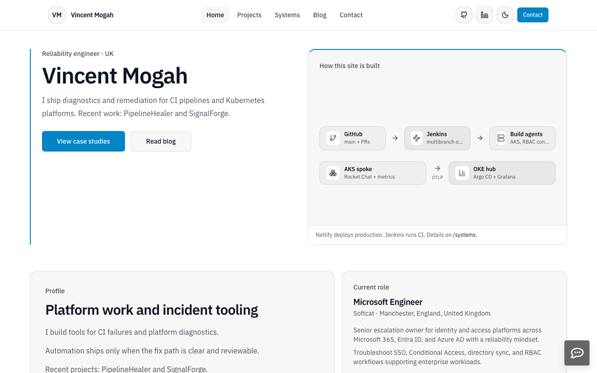

# Portfolio Website

> Production-focused portfolio built with Next.js (App Router), TypeScript, Bun, Tailwind, and MDX.

[](https://portfolio.canepro.me)
[](https://nextjs.org/)
[](https://www.typescriptlang.org/)
[](https://reactjs.org/)

<div align="center">
  
</div>

## 🚀 Featured: Hub-and-Spoke Platform (OKE Hub + AKS Spoke)

This portfolio highlights hands-on **Kubernetes + SRE** work with a clear **Infrastructure vs. Application** story:

- **OKE Hub (control plane)**: ArgoCD-managed GitOps + GrafanaLocal (LGTM) + telemetry ingest (**authentication required**) at `https://argocd.canepro.me` and `https://grafana.canepro.me`
- **AKS Spoke (workloads)**: Rocket.Chat platform work + constrained Jenkins agent (permissions boundaries)
- **Signals flow**: application metrics/traces/logs ship from the spoke into the hub (OTLP), so one place answers “what changed and what broke?”

For a skimmable overview of how these pieces fit together, see `/systems` in the site.

For PipelineHealer internals, use the architecture diagram in the project repo: `https://github.com/Canepro/pipelinehealer#architecture`.

## ✨ Features

- **Project demos & links** - Recruiter-friendly live endpoints where available (clearly labeled when authentication is required)
- **Modern Design** - Clean, responsive layout with smooth animations
- **TypeScript** - 100% type-safe with comprehensive interfaces
- **Performance** - Optimized with Next.js Image, ISR, and code splitting
- **Accessibility** - ARIA labels, keyboard navigation, screen reader support
- **SEO Optimized** - Meta tags, structured data, dynamic sitemap
- **Interactive Projects** - Live demos and analytics tracking for engagement metrics
- **MDX Blog** - Static-first writing via `content/blog/*.mdx`
- **Systems Overview** - A “30-second map” at `/systems` (OKE hub + AKS spoke + CI + telemetry)
- **📊 Dual Analytics System** - Professional RUM + Custom DevOps metrics showcase
- **🔍 Frontend Observability** - Core Web Vitals, user journeys, error monitoring
- **⚡ Custom Metrics API** - Prometheus exporter demonstrating observability skills
- **📈 Real-time Monitoring** - Grafana Cloud integration with persistent session tracking
- **Markdown Rendering** - Rich project documentation with proper typography
- **Real-time Stats** - GitHub statistics with incremental static regeneration
- **Contact Form** - Email delivery via SMTP with rate limiting
- **Sandbox demos** - Kubernetes sandbox environments for hands-on operations (no misleading uptime/cost claims)
- **Container Ready** - Docker support with health checks
- **CI** - Jenkins multibranch validation + Netlify deploy previews; production deploys from `main`

## 🛠️ Tech Stack

| Category          | Technology                                          |
| ----------------- | --------------------------------------------------- |
| **Framework**     | Next.js 15.5.12                                     |
| **Language**      | TypeScript 5.9.2                                    |
| **UI Library**    | React 19.2.4                                        |
| **Styling**       | Tailwind + CSS variables (legacy styled-components) |
| **UI Components** | shadcn-inspired primitives                          |
| **Icons**         | react-icons, lucide-react                           |
| **Animations**    | framer-motion                                       |
| **Deployment**    | Netlify                                             |
| **CI**            | Jenkins (Kubernetes agent)                          |
| **Analytics**     | Grafana Faro, Custom Prometheus Exporter            |
| **Monitoring**    | Grafana Cloud, Grafana Alloy, Real User Monitoring  |

## 📊 Advanced Monitoring & Analytics

This portfolio demonstrates enterprise-grade monitoring capabilities through a sophisticated dual analytics system showcasing real-world DevOps engineering skills.

### 🎯 Dual Analytics Architecture

**1. Professional Real User Monitoring (RUM)**

- **Grafana Faro Frontend Observability** - Industry-standard user experience monitoring
- **Core Web Vitals Tracking** - LCP, FID, CLS performance metrics
- **Error Monitoring** - JavaScript error tracking and alerting
- **User Journey Analytics** - Complete session tracking with persistent storage

**2. Custom DevOps Metrics Demonstration**

- **Custom Prometheus Exporter** (`/api/metrics`) - Demonstrates observability engineering
- **Portfolio-Specific Metrics** - Demo clicks, engagement tracking, conversion analytics
- **Grafana Alloy Integration** - Modern metrics collection agent
- **Grafana Cloud Dashboard** - Real-time visualization of custom business logic

### 💼 Professional Value

This implementation showcases:

- **DevOps Engineering** - Custom Prometheus metrics, Grafana integration
- **Production Observability** - Real user monitoring, error tracking
- **Modern Tech Stack** - Latest Grafana tools (Faro, Alloy, Cloud)
- **Meta-Demonstration** - Portfolio monitors itself while visitors explore

_The dual analytics provides both business insights and demonstrates advanced monitoring capabilities sought by DevOps organizations._

## 🚀 Quick Start

### Prerequisites

- Bun 1.3.5+ ([install Bun](https://bun.sh/docs/installation))
- Node.js 20+ (recommended 22) - required for Next.js runtime

### Installation

```bash
# Clone the repository
git clone https://github.com/Canepro/portfolio_website-main.git
cd portfolio_website-main

# Install dependencies
bun install

# Set up environment variables (see Configuration section)
cp .env.example .env.local
# Edit .env.local with your values

# Start development server
bun run dev
```

Open [http://localhost:3000](http://localhost:3000) to view the site.

### Available Scripts

| Command                | Description                          |
| ---------------------- | ------------------------------------ |
| `bun run dev`          | Start development server (port 3000) |
| `bun run dev:3001`     | Start development server (port 3001) |
| `bun run build`        | Create production build              |
| `bun run start`        | Start production server              |
| `bun run lint`         | Run ESLint for code quality checks   |
| `bun run format`       | Format code with Prettier            |
| `bun run format:check` | Check code formatting                |
| `bun run typecheck`    | Run TypeScript type checking         |

## 🐳 Docker / Podman

This repo ships a production-ready `Dockerfile` (multi-stage, non-root runtime, healthcheck).

```bash
docker build -t portfolio:test .
docker run --rm -p 3000:3000 --name portfolio-test portfolio:test
```

Podman:

```bash
podman build --format docker -t portfolio:test .
podman run --rm -p 3000:3000 --name portfolio-test portfolio:test
```

### Upgrading Bun

This project is pinned to **Bun 1.3.5** for reproducible builds. To upgrade:

1. **Update version in `package.json`**:

   ```json
   "packageManager": "bun@<new-version>"
   ```

2. **Update `netlify.toml`**:

   ```toml
   [build.environment]
     BUN_VERSION = "<new-version>"
   ```

3. **Update `Dockerfile`** (if using Docker):

   ```dockerfile
   FROM docker.io/oven/bun:<new-version>-alpine
   ```

4. **Regenerate lockfile**:

   ```bash
   bun install
   ```

5. **Test locally**:
   ```bash
   bun run typecheck
   bun run build
   bun run start
   ```

## ⚙️ Configuration

### Environment Variables

Copy the example environment file and configure your values:

```bash
cp .env.example .env.local
```

Then edit `.env.local` with your actual values. See `.env.example` for all available options:

```bash
# Analytics (Optional)
NEXT_PUBLIC_GA_ID=G-XXXXXXXXXX

# Rocket.Chat Live Chat (Optional)
NEXT_PUBLIC_RC_ENABLED=1
NEXT_PUBLIC_RC_URL=https://your-instance.rocket.chat/livechat

# Contact Form (Optional)
CONTACT_SMTP_HOST=your-smtp-host
CONTACT_SMTP_PORT=587
CONTACT_SMTP_USER=your-username
CONTACT_SMTP_PASS=your-password
CONTACT_TO=recipient@example.com

# GitHub API (Optional - increases rate limits)
GITHUB_TOKEN=your-github-token
```

### Features

- **Contact Form**: Configure SMTP settings to enable email delivery
- **Live Chat**: Set `NEXT_PUBLIC_RC_ENABLED=1` to enable Rocket.Chat widget
- **Analytics**: Add Google Analytics ID for tracking
- **GitHub Stats**: Include token for higher API rate limits

## 📁 Project Structure

```
portfolio_website-main/
├── public/                 # Static assets
│   └── images/            # Project images and screenshots
├── content/
│   └── blog/              # MDX blog posts
├── src/
│   ├── app/              # Next.js App Router pages (primary)
│   ├── pages/            # Legacy Pages Router (API routes only)
│   │   └── api/          # /api/contact, /api/metrics
│   ├── components/       # UI and page components
│   ├── constants/        # Projects/certifications data
│   ├── content/          # Profile/experience/skills content
│   ├── lib/              # Utilities (blog parsing, URL sanitization, analytics)
│   └── styles/           # Global CSS + legacy styled-components
├── docs/                 # Documentation
├── Dockerfile            # Container configuration
├── Jenkinsfile           # Jenkins multibranch CI pipeline
└── netlify.toml          # Netlify build configuration
```

## 🎨 Design System

- **Typography**: IBM Plex Sans (body) + IBM Plex Mono (code) via `next/font`, with CSS vars `--font-sans` / `--font-mono`
- **Colors**: Single accent — sky-500 (`#0EA5E9`) on dark, sky-600 (`#0284C7`) on light. Dark theme base is charcoal/ink (`#0F1115`). No neon or haze gradients.
- **Components**: shadcn-inspired primitives in `src/components/ui/*` — Button (CVA), Badge (incl. `tech` variant), Card, Input — with a `cn()` helper (clsx + tailwind-merge)
- **Animations**: Minimal, meaningful motion via framer-motion; respects `prefers-reduced-motion`
- **Responsive**: Mobile-first layout with consistent spacing and readable font sizes

## 📚 Documentation

- **[Architecture](docs/ARCHITECTURE.md)** - Technical architecture and TypeScript integration
- **[Deployment](docs/DEPLOYMENT.md)** - Deployment guide and troubleshooting
- **[Roadmap](docs/ROADMAP.md)** - Current focus and future plans
- **[Maintenance](docs/MAINTENANCE.md)** - Branch strategy and repo hygiene
- **[Changelog](CHANGELOG.md)** - Version history and updates

## 🔧 Development

### TypeScript

The project is fully migrated to TypeScript with:

- Strict type checking enabled
- Comprehensive type definitions
- Zero compilation errors
- Enhanced developer experience

### Styling

- **Tailwind + CSS variables** for all new UI work; accent is sky-500 (`--color-accent`)
- **shadcn-style primitives** (`src/components/ui/*`) for buttons, badges, cards, inputs
- **Legacy styled-components** still present in parts of the codebase (kept but not extended)
- **Dark-first theming** (respects `prefers-color-scheme` when no saved preference)

### Performance

- **Image optimization** with Next.js Image component
- **Code splitting** for optimal bundle sizes
- **Incremental Static Regeneration** for dynamic content
- **Lighthouse score** > 95

## 🚀 Deployment

The site is automatically deployed to Netlify from the `main` branch. PRs get deploy previews. See [Deployment Guide](docs/DEPLOYMENT.md) for detailed configuration.

CI validation runs in Jenkins (multibranch pipeline) on Kubernetes pod agents.

### Production Checklist

- [ ] TypeScript compilation passes
- [ ] All pages build successfully
- [ ] Environment variables configured
- [ ] Performance metrics meet targets
- [ ] Accessibility standards met
- [ ] SEO optimization complete

## 🤝 Contributing

See [CONTRIBUTING.md](CONTRIBUTING.md) for development guidelines and contribution process.

## 📄 License

This project is for portfolio purposes. All rights reserved.

---

<div align="center">
  <p>Built with ❤️ using Next.js and TypeScript</p>
  <p>
    <a href="https://portfolio.canepro.me">Live Site</a> •
    <a href="https://github.com/Canepro/portfolio_website-main/issues">Issues</a> •
    <a href="https://github.com/Canepro/portfolio_website-main/pulls">Pull Requests</a>
  </p>
</div>
